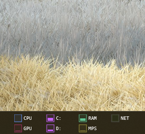

# dots: system monitor skin for Rainmeter

A Rainmeter skin to monitor your system resources that fits within the Windows taskbar.



## Features

* **Compact:** Displays key system metrics in the Windows taskbar.
* **Monitoring:** Keep an eye on CPU, RAM, Disk Usage (C: and D: drives), Network activity (download/upload), memory pressure (basic), and GPU utilization.
* **Graphs:** Hover over each metric's square to reveal a real-time historical graph.
* **Customizable:** Easily adjust fonts, colors, labels, and layout directly from the skin's variables.


## Installation

1.  If you don't have it, download and install Rainmeter from the [official website](https://www.rainmeter.net/).
2.  Download the ZIP file of this repository and extract its contents to your Rainmeter skins folder (usually in `Documents\Rainmeter\Skins`).
3.  **Load the Skin:**
    * Open Rainmeter.
    * Navigate to `dots` (or the name you give your skin folder) in the Rainmeter manage window.
    * Double-click the `.ini` file (e.g., `dots.ini`) to load the skin.


## Customization

You can customize the skin by editing the `[Variables]` section in the `.ini` file.

1.  Right-click on the skin on your desktop.
2.  Select `Edit skin`.
3.  Modify the variables under the `[Variables]` section.
4.  Save the file and then right-click on the skin and select `Refresh skin` to apply changes.

Here's a breakdown of the key customizable variables:

* **`FontFace`**, **`FontSize`**, **`FontColor`**: Adjust the appearance of the text.
* **`BackgroundColor`**, **`BorderColor`**: Change the overall background and border of the skin.
* **`CPUColor`**, **`RAMColor`**, etc.: Set the colors for each individual metric's bar and graph.
* **`CPUBoxColor`**, **`RAMBoxColor`**, etc.: Define the background color of each metric's square. Typically is the same as the bar/graph colors but with 20% opacity.
* **`CPULabel`**, **`RAMLabel`**, etc.: Change the text labels for each metric.
* **`SquareSize`**, **`GraphWidth`**, **`Spacing`**, **`BarPadding`**, **`LabelWidth`**, **`LabelPadding`**: Fine-tune the dimensions and spacing of the skin elements.
* **`ColsUsed`**, **`RowsUsed`**: Adjust the number of columns and rows used by the skin to fit your desired layout.
* **`MeasureNetworkTotal/25000000`**: In `[MeasureNetworkPct]`, the `25000000` represents the maximum network speed in bytes per second. Adjust this value to match your internet connection speed for accurate percentage readings. (e.g., for a 100 Mbps connection, it's `12500000` bytes/s (100 * 10^6 / 8)).
* **`Instance` in `[MeasureGPUUsage]`**: If your GPU usage isn't displaying correctly, you may need to adjust the `Instance` value to match your specific GPU's 3D engine instance.
  1. Open Terminal
  2. Enter `typeperf -qx "\GPU Engine" to see a dump of all counters in the GPU Engine category.
  3. Look for lines like these:
 
      PID4 is the system-wide 3D utilization.
      ```bash
        \GPU Engine(pid_4268_luid_0x00000000_0x00012507_phys_0_eng_0_engtype_3D)\Utilization Percentage
        \GPU Engine(pid_4_luid_0x00000000_0x00012507_phys_0_eng_0_engtype_3D)\Utilization Percentage
      ```
  4. Replace the instance in `[MeasureGPUUsage]`.


## Requirements

* [Rainmeter](https://www.rainmeter.net/)


## Contributing

Feel free to fork this repository, make improvements, and submit pull requests.

---

## License

This project is open-source and available under the [MIT License](LICENSE).
